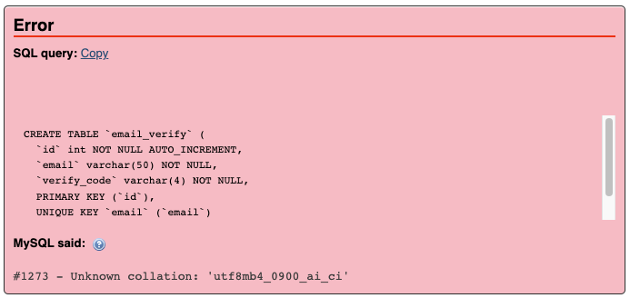
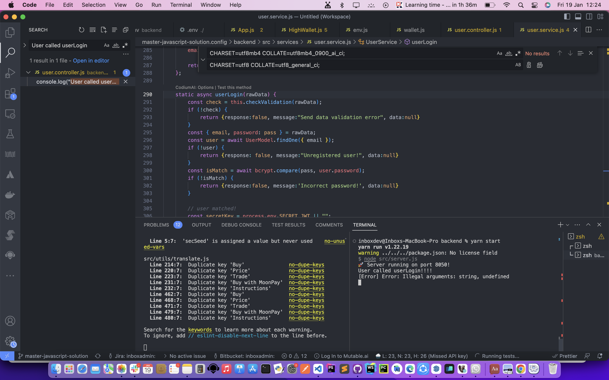
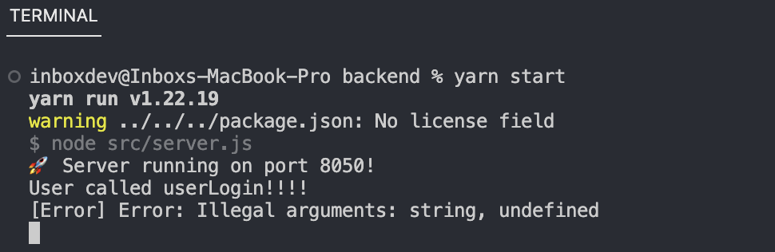
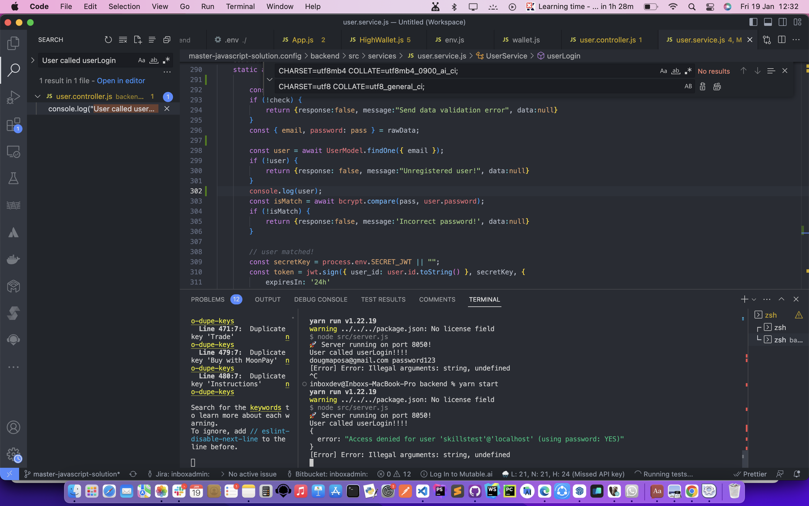
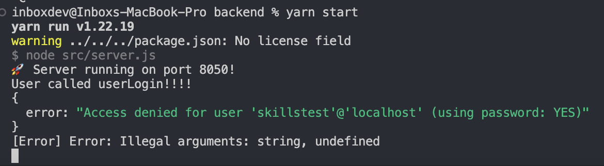
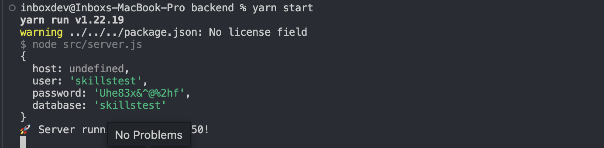
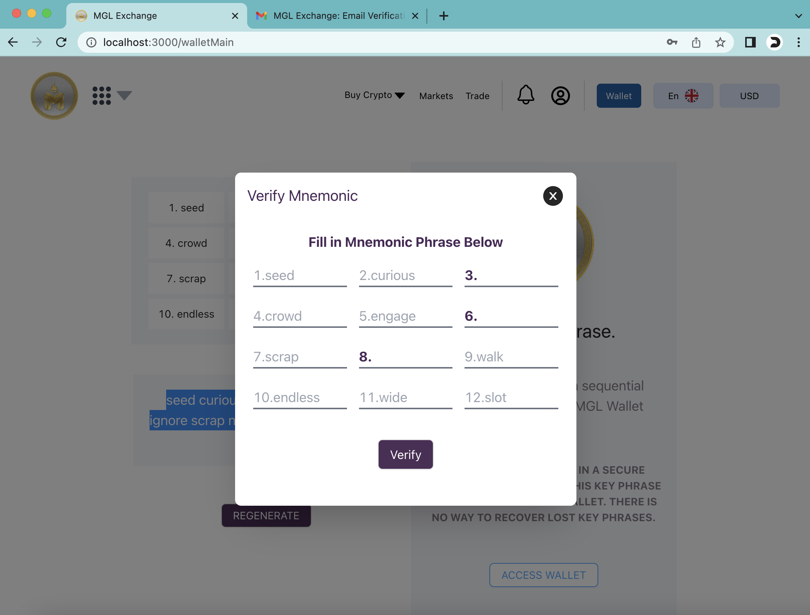

# Problem
1. User can not register in account. 
2. And can not login to profile page.
3. The current Eth price is missing on the profile page.

<br>

# Solution

This project is a solution to a github test that involved fixing some bugs and displaying the ETH price on a web app. The app uses Node.js, Express, MySQL, React, and Web3.

## Installation

To run this project, you need to have Node.js version 16 and MySQL installed on the machine. You also need to create an account on [SMTP2GO](https://www.smtp2go.com/) and verify the business email.

## Database Migration

First, you need to create a database and load some SQL statements from the `/backend/src/db/new_mgldefi.sql` file. You can use the following commands:

```bash
# login to mysql server
>  mysql -uroot -p

# load the SQL statements from the file
> source /backend/src/db/new_mgldefi.sql;
```

Note that the SQL statements in the file may have some errors and missing collations. You need to fix them before loading them into the database. For example, you may need to change the `CREATE TABLE` statements to include the `COLLATE` option, such as:

```sql
CREATE TABLE `transaction` (
  `id` int NOT NULL AUTO_INCREMENT,
  `user_id` int NOT NULL,
  `hash` varchar(100) NOT NULL,
  `from_id` text NOT NULL,
  `to_id` text NOT NULL,
  `token` varchar(42) NOT NULL,
  `amount` float NOT NULL,
  `network` varchar(20) NOT NULL,
  `to_admin` tinyint(1) NOT NULL,
  PRIMARY KEY (`id`)
) ENGINE=InnoDB DEFAULT CHARSET=utf8 COLLATE=utf8_general_ci;
```

## Node Environment

The app uses Node v16, so you need to make sure the environment is set to that version. You can use [nvm](https://github.com/nvm-sh/nvm) to install and switch between different versions of Node. You can use the following commands:

```bash
# install Node v16
nvm install 16.20.2

# set Node v16 as default
nvm use 16.20.2
```

You also need to update the `package.json` file to specify the Node engine to v16.20.2. You can add the following line to the `package.json` file:

```json
"engines": {
  "node": "16.20.2"
},
```

## Environment Variables

You need to create a `.env` file in the root directory of the project and set some environment variables. You need to provide the following values:

SMTP2GO
- `EMAIL_USER`: the SMTP2GO username
- `EMAIL_PWD`: the SMTP2GO password
- `EMAIL_PORT` : the SMTP2GO port
- `EMAIL_HOST`: the SMTP2GO host, usually `mail.smtp2go.com`
- `EMAIL`: the verified business email on SMTP2GO

Database
- `DB_HOST`: the database host, usually `localhost`
- `DB_PORT`: the database port, usually `3360`
- `DB_DATABASE`: the database name, `skilltest_user`
- `DB_USER`: the database user, if any
- `DB_PASS`: the database password, if any

An example `.env` file may look like this:

```env
# Email Configs
EMAIL_HOST=mail.smtp2go.com
EMAIL_SERVICE=smtp2go
EMAIL_PORT=2525
EMAIL_USER=inboxgroup.ai
EMAIL=systemadmin@inboxgroup.ai
EMAIL_PWD=w9uPJDBI7FVJ7a0C

# Database Config
DB_HOST=localhost
DB_USER=skilltest_user
DB_PASS=p4$$w07D#12345
DB_DATABASE=skillstest_db
```

## Package.json File

You need to install all the dependencies for the backend and the frontend. You can use the following commands:

```bash
# install frontend dependencies
yarn install

# install backend dependencies
cd backend
yarn install
```

Note that the app uses Web3 v1.6.1, which has a breaking change from the latest versions. You need to make sure you do not update Web3 to a higher version. You can check the Web3 version in the `package.json` file:

```json
"dependencies": {
  ...
  "web3": "1.6.1",
  ...
},
```

You also need to fix an issue on the React startup scripts. You need to change the `start` script in the `package.json` file to the following:

```diff
--"scripts": {
--  "server": "cd backend & npm start",
--},
++"scripts": {
++  "server": "cd backend && npm start",
++},
```

## Usage

To run the app, you need to start the backend server and the frontend server. You can use the following commands:

```bash
# start the backend server
cd backend
yarn start

# start the frontend server
cd ..
yarn start
```

or you can run all at once with the following

```bash

# starts the server first then the frontend app
yarn dev

```

The frontend app should be running on `http://localhost:3000`.

The backend app should be running on `http://localhost:5000`.

## API Testing

To test the backend, you can use [Postman](https://www.postman.com/) to send requests to the API endpoints. 

You can import thefollowing files:
1. `/backend/postman tests/ieo.postman_collection.json`
2. `/backend/postman tests/p2p.postman_collection.json`
3. `/backend/postman tests/user.postman_collection.json` 

These files for Postman containes some example requests.

## Display ETH Price

To display the ETH price on the web app, you need to leverage the existing function `getTokenPriceInUsd` in the `src/components/pages/Wallet.js` file. You need to update the `currentEthPrice` state variable with the returned value from the function. You can use the following code:

```js
// import the useEffect hook
import React, { useState, useEffect } from 'react';

// ...

// define the ethPrice state variable
const [currentEthPrice, setCurrentEthPrice] = useState(0);

// ...

// call the getEthPrice function on component mount
  useEffect(() => {
    const displayEthPrice = async () => {
      const ethPriceResult = await getTokenPriceInUsd(network, network.ethAddr);
      setCurrentEthPrice(ethPriceResult);
    }
    displayEthPrice();
  }, [network])

// ...

// display the ethPrice state variable on the web app
return (
  <Col>
    ...
    <p className="text-xxxl font-bold myColor1">1 ETH = ${parseFloat(currentEthPrice).toFixed(2)} USD </p>
    ...
  </Col>
);

```

<br><br><br>

# Challenges Encountered

While working on this project, I faced some challenges that required me to debug and fix some errors. Here are some of the bugs that I encountered and how I solved them:

<br>

## 1. Updating the package.json File

One of the challenges was to update the `package.json` file to install the latest versions of the dependencies for the backend and the frontend. However, updating the entire `package.json` file resulted in a lot of breaking changes, as some of the dependencies had major changes in their APIs or functionalities. For example, the Web3 library had a breaking change in version 1.6.0 that caused some errors in the app. I had to revert to the default version 1.5.2 that was specified in the original `package.json` file.

It is important to keep the libraries up to date, as they may have new features, bug fixes, or security patches that can improve the performance and security of the app. However, it is also important to check the compatibility and stability of the updated libraries, as they may have some changes that are not backward compatible or may introduce new bugs. Therefore, it is advisable to update the libraries one by one, and test the app after each update, to ensure that everything works as expected.

Fixed in [Commit 31e9cf4](https://github.com/dovellous/skill-test/commit/31e9cf4d28d35ea6759d758c953aaa1b07e27b8c)

<br>

## 2. Fixing the Database Collations

MySQL server running on the destination is an older version than the source. So we got that the destination server doesn’t contain the required database collation. This prevented the import from being successful. 



I had to fix the errors and replace the collations with the ones that matched my local MySQL server. For example, I had to change the collation from `utf8mb4_0900_ai_ci` to `utf8_general_ci`, as the former was not supported by my MySQL server version.

Replace:
```sql
ENGINE=InnoDB DEFAULT CHARSET=utf8mb4 COLLATE=utf8mb4_0900_ai_ci;
```

With:
```sql
ENGINE=InnoDB DEFAULT CHARSET=utf8 COLLATE=utf8_general_ci;
```

The advantage of changing the collation to match the local server is that it ensures that the data is stored and retrieved in a consistent and correct way. The collation determines how the data is sorted and compared, and different collations may have different rules for handling characters, accents, case sensitivity, and so on. By using the same collation as the local server, I avoided any potential errors or inconsistencies that may arise from using different collations.

Fixed in [Commit d27c5ef](https://github.com/dovellous/skill-test/commit/d27c5efa961d68e69aada531c86337222f7ef9bf)

<br>

## 3. Adding the Parenthesis to the Wallet Controller Class

The last challenge was to fix a bug in the Wallet controller class. The class was missing the parenthesis when it was instantiated, which caused a syntax error. I had to add the parenthesis to the class name, as shown below:

```diff
--// original code
--module.exports = new UserController;

++// fixed code
++module.exports = new UserController();
```

The advantage of fixing this bug is that it makes the code more readable and consistent. In JavaScript, the parenthesis are optional when calling a constructor function with no arguments, but they are required when calling a class constructor. By adding the parenthesis, I followed the standard convention for creating class instances, and avoided any confusion or ambiguity that may arise from omitting them.

Fixed in [Commit 8cd4b5b](https://github.com/dovellous/skill-test/commit/8cd4b5b9c334748d50c6c3296c74cdf2cf3bd1bf)

<br>

## 4. Error connectng Database

While working on this project, I encountered an error when trying to connect to an existing database on my local server. The error message was "`Access denied for user...`".

### Solution: Step 1 - Browser debugging

To resolve the issue, I first checked the browser console and found that the API call was returning a 500 error. 



### Solution: Step 2 - Terminal debugging (API)

I then checked the backend terminal console and found that the database connector was not handling errors properly.





### Solution: Step 3 - Log data at various levels within the code

To debug the issue, I added some logging statements to the backend code and dumped the API call result data within the backend. 



### Solution: Step 4 - Check the database connectivity
This helped me identify the root cause of the issue and fix the database connector. I was able to find the root cause. The host was undefined because the env variable was defined as `HOST` instead of `DB_HOST`



### Conclusion

In conclusion, I learned that proper error handling is crucial when working with databases. By adding logging statements and debugging the API call result data, I was able to identify and fix the issue. This experience has taught me valuable lessons that I can apply to future projects.

Fixed in [Commit 8cd4b5b](https://github.com/dovellous/skill-test/commit/8cd4b5b9c334748d50c6c3296c74cdf2cf3bd1bf)

<br><br>

# Recommendations

### 1. Move all files pertaining to the frontend:
Create a frontend folder and move the files there to organize the project. This helps in maintaining a clean project structure and makes it easier for developers to locate frontend-related files.
- It is always a good practice to organize the codebase. We create a new folder named `frontend` and move all the frontend files into it. This will make it easier to manage the frontend codebase.

### 2. Consider using Typescript language:
Typescript offers several advantages over JavaScript, such as static type-checking, better IDE support, and improved code maintainability:
 - **Type safety**: TypeScript provides type safety, which means that it can catch errors at compile-time rather than at runtime. This makes it easier to catch bugs early in the development process.
- **Better tooling**: TypeScript provides better tooling support than JavaScript. It has better code completion, refactoring, and debugging support.
- **Improved scalability**: TypeScript is more scalable than JavaScript. It is easier to maintain large codebases with TypeScript.

- To convert a JavaScript project to Typescript, follow these steps:

```
    1. Install TypeScript: `npm install typescript --save-dev`
    2. Create a `tsconfig.json` file in the root directory of the project.
    3. Run `yarn add typescript @types/node @types/react @types/react-dom @types/jest --dev`
    4. Convert the `.js` files to `.ts` files.
    5. Update the imports and exports to use the TypeScript syntax.
    6. Run the TypeScript compiler: `tsc`
```

### 3. Remove unused imports and variables:
Removing unused imports and variables has several advantages:
- **Reduced file size**: Removing unused imports and variables can reduce the size of the codebase, which can improve performance.
- **Improved readability**: Removing unused imports and variables can make the code more readable and easier to understand.
- **Fewer bugs**: Unused imports and variables can lead to bugs in the code. Removing them can help prevent these bugs from occurring.

### 4. Use the latest JavaScript coding standards:
Adhering to the latest JavaScript coding standards ensures that the codebase is modern, maintainable, and follows best practices.
- We can use tools like ESLint to enforce coding standards.

### 5. Use readable user-friendly variables:
Descriptive variable names improve code readability and maintainability, making it easier for developers to understand the purpose of the variables.
- When naming the variables, use readable user-friendly variables. In some cases, there was a variable referring to a user. It was named `use` instead of `user`.
- Using readable user-friendly variables is a good practice. 
- We have to use descriptive names that accurately reflect what the variable represents. In the case of the variable referring to a user, it should be named `user` instead of `use`.

### 6. Use Redux for central data storage:
Incorporating Redux provides a centralized and predictable state management solution for the application. 
- It is a good practice and it makes it easier to manage the state of the application. - To incorporate Redux into the application, you need to follow these steps:

```
    1. Install Redux: `npm install redux react-redux --save`
    2. Create a `store.js` file in the root directory of the project.
    3. Define the initial state and reducers in the `store.js` file.
    4. Wrap the application in a `Provider` component from `react-redux`.
    5. Use the `connect` function from `react-redux` to connect components to the Redux store.
```

### 7. Implement Test Driven Development (TDD):
Test Driven Development offers advantages such as improved code quality, better test coverage, and early detection of bugs. We start by writing tests for the existing codebase and then gradually introduce new features following the TDD cycle: write a test, make it pass, refactor.
#### Advantages of TDD
- **Fewer bugs**: TDD can help catch bugs early in the development process, which can reduce the number of bugs in the code.
- **Improved design**: TDD can help improve the design of the code by forcing you to think about the requirements before writing code.
- **Faster development**: TDD can help speed up the development process by catching bugs early and reducing the amount of time spent debugging.

To achieve TDD on an already existing application, you need to follow these steps:
```
    1. Write a failing test for the feature you want to implement.
    2. Write the minimum amount of code required to make the test pass.
    3. Refactor the code to improve its design.
    4. Repeat steps 1-3 for each feature you want to implement.
```

### 8. Simplify the wallet address:
Simplifying the wallet address can improve user experience, especially in DApps. Consider using a function in Typescript to achieve this, ensuring that the simplified address still uniquely represents the original address.

The function below takes an Ethereum wallet address as a string and returns a shortened version of the address. It extracts the first 6 characters and the last 4 characters of the address and concatenates them with ellipses in between. This creates a shorter, more readable version of the address while still preserving its uniqueness.

```ts

function shortenAddress(address: string): string {
  const prefix = address.slice(0, 6);
  const suffix = address.slice(-4);
  return `${prefix}...${suffix}`;
}

```

For example `0xb794f5ea0ba39494ce839613fffba74279579268` becomes `0xb794...9268`

### 9. Improve the generation of a wallet address and mnemonic phrase:
WHen creating a wallet address the system allows the user to generate menomic phrase but there is a usability issue. The user is told to verify the code on a modal and its easy because the user sees the phrases behind the modal and some phrases are already prepopulated. I think this weakens the security bit and is not user intuitive.



To enhance security and user experience, consider benchmarking the approach with other wallets in various DApps. Provide a more intuitive and secure method for the user to verify the mnemonic phrase without compromising security.

### 10. Consider integrating other wallet providers
[Moralis](https:moralis.io) is a platform that provides enterprise-grade Web3 APIs and tools for blockchain development. Moralis supports MetaMask, Coinbase Wallet, and WalletConnect as authentication methods, as well as other wallets like Fortmatic, Torus, and Portis.

Some of the advantages of using these wallet providers are:

- **MetaMask**: MetaMask is one of the most popular and widely used Web3 wallets, it supports Ethereum and various EVM-compatible blockchains, as well as custom networks and tokens.

- **Coinbase Wallet**: Coinbase Wallet is a non-custodial wallet app that lets users manage their own private keys and access Web3 applications. It supports Ethereum, Bitcoin, Bitcoin Cash, Litecoin, and many other cryptocurrencies, as well as ERC-20 and ERC-721 tokens.

- **WalletConnect**: WalletConnect is an open-source protocol that enables secure communication between Web3 applications and mobile wallets. It supports multiple blockchains, such as Ethereum, Binance Smart Chain, Polygon, Avalanche, and more.

#### How to intergrate Moralis' Web3 Auth API
The steps below ouline briefly on how to intergrate the Moralis API.
We can also intergrate the individual wallet independantly using respective npm packages.
```
1. Sign up with Moralis and create a new server. You will get a `serverURL` and an `applicationID` that you will need later.
2. Import the Moralis library using npm or yarn.
3. Open the `App.js` file and replace the placeholders with the server URL and application ID.
4. Use Moralis' Web3 Auth API to enable different authentication methods, such as `authenticate()`, `link()`, `unlink()`, and `logout()`.
```

### 11. Add Swagger API Docs
I suggest using documentation for our APIs which can be accessed publicly. 
Swagger is a powerful tool that can help you document, test, and write API structures. Here are some of the advantages of using Swagger:

- Swagger automates the documentation process, which means it picks up the methods with GET, PUT, POST, DELETE attributes and prepares the documentation by itself. If any changes are implemented, then the Swagger documentation is automatically updated.
- Swagger provides a UI integrated page where all the API methods are listed and enables the user to test any method that is required from the UI.

To add Swagger to an existing Node.js API service, you can follow these steps:

1. Install the `swagger-ui-express` and `swagger-jsdoc` packages using npm:
```bash
npm install swagger-ui-express swagger-jsdoc
```

2. Import the packages in your Node.js file:
```javascript
const swaggerUI = require('swagger-ui-express');
const swaggerJsDoc = require('swagger-jsdoc');
```

3. Define the Swagger options and initialize the Swagger UI:
```javascript
const swaggerOptions = {
  swaggerDefinition: {
    info: {
      title: 'API Title',
      description: 'API Description',
      contact: {
        name: 'API Developer'
      },
      servers: ['http://localhost:3000']
    }
  },
  apis: ['app.js']
};

const swaggerDocs = swaggerJsDoc(swaggerOptions);
app.use('/api-docs', swaggerUI.serve, swaggerUI.setup(swaggerDocs));
```

4. Run the server and navigate to `http://localhost:5000/api-docs` to view the Swagger UI.

To use Swagger, you can follow these steps:

1. Define the Swagger options and initialize the Swagger UI as shown above.
2. Add the Swagger annotations to your API routes:
```javascript
/**
 * @swagger
 * /users:
 *   get:
 *     description: Get all users
 *     responses:
 *       200:
 *         description: Success
 */
app.get('/users', (req, res) => {
  // Your code here
});
```

3. Run the server and navigate to `http://localhost:5000/api-docs` to view the Swagger UI and test your API routes.


